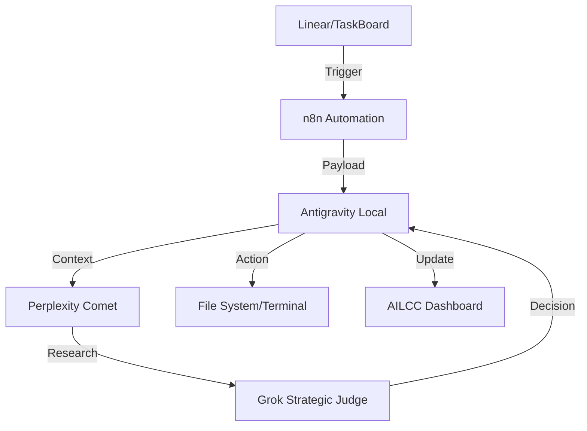

# Automation Empire: Interoperability Architecture

**Master Definition**: [AI_MASTERMIND_ALLIANCE_MASTER_DEFINITION.md](file:///Users/infinite27/AILCC_PRIME/AI_MASTERMIND_ALLIANCE_MASTER_DEFINITION.md)

This document defines the high-level orchestration flow between the local AILCC environment, web research agents, and task management systems.

## 🌌 Orchestration Flow

## 🤖 Component Roles

### Antigravity (Local Context)
- **Primary Role**: The Bridge and Executioner.
- **Functions**: Manages local file state, executes terminal commands, provides system context to web agents.

### Perplexity Comet (Search & Deep Research)
- **Primary Role**: The Scout.
- **Functions**: Real-time web searching, identifying market trends, academic source verification, and exhaustive research.

### Grok (Strategic Validation)
- **Primary Role**: The Judge.
- **Functions**: Strategic reasoning, "Brutal Honesty" logs analysis, validating automation plans for ROI and ethics.

## 📂 Automation Buckets

1. **Business Ops**: Scaling "Fresh Coats" via automated outreach and client management.
2. **Learning**: Synthesizing Bio/Psych/Neuro content for academic mastery.
3. **Health**: Monitoring Vitality protocols and health metric correlations.
4. **Wealth**: Identifying and automating passive income streams.
5. **Relationships**: Managing impact systems and engagement triggers.
6. **Prime**: Orchestrating daily rituals for peak performance.

## 🛠️ Triggers & Integrations
- **Webhooks**: n8n local triggers.
- **CLI**: `sys_check`, `launch_cc`, `protocol_inspector.py`.
- **Linear**: Bi-directional sync with task state.
