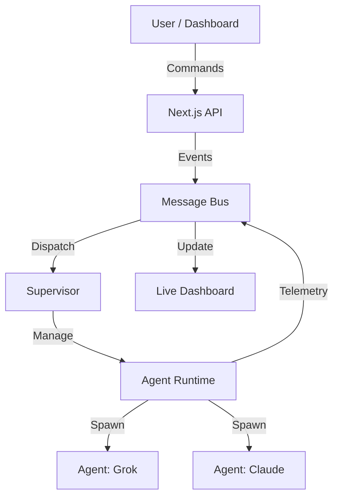

# AILCC Framework

**AI Lifecycle Command Center**  
*The central operating system for autonomous multi-agent orchestration.*

---

## 🚀 Phase 4: Forge Runtime & Supervisor

The **Forge Runtime** is the beating heart of the AILCC framework. It provides a collaborative environment where AI agents can be spawned, managed, and orchestrated by a Supervisor.

### 🧩 Key Components

-   **Runtime (`forge-monitor/runtime`)**: The execution environment for agents. Handles memory, state, and lifecycle events.
-   **Supervisor (`forge-monitor/supervisor`)**: The orchestration layer. Uses an event bus to dispatch tasks and monitor agent health.
-   **Dashboard (`dashboard/`)**: A Next.js-based real-time visualization of the runtime state.

### 🛠️ Architecture



## ⚡ Getting Started

### Prerequisites
- Node.js 18+
- npm 9+

### Installation

```bash
git clone https://github.com/infinitexzero-AI/ailcc-framework.git
cd ailcc-framework
npm install
```

### Running the Environment

**1. Start the Dashboard (Development Mode)**
```bash
npm run dashboard:dev
# Opens http://localhost:3000
```

**2. Run Tests**
```bash
# Run all Forge Monitor tests
npm test -- forge-monitor/

# Run complete suite
npm test
```

## 🤝 Contributing

We welcome contributions! Please follow our guidelines:
1.  **Issues**: Check `bug_report.md` or `feature_request.md`.
2.  **PRs**: Use the provided PR template. All changes must pass `npm test`.
3.  **Style**: We use ESLint and strict TypeScript.

---
*Maintained by InfinitexZero AI*
