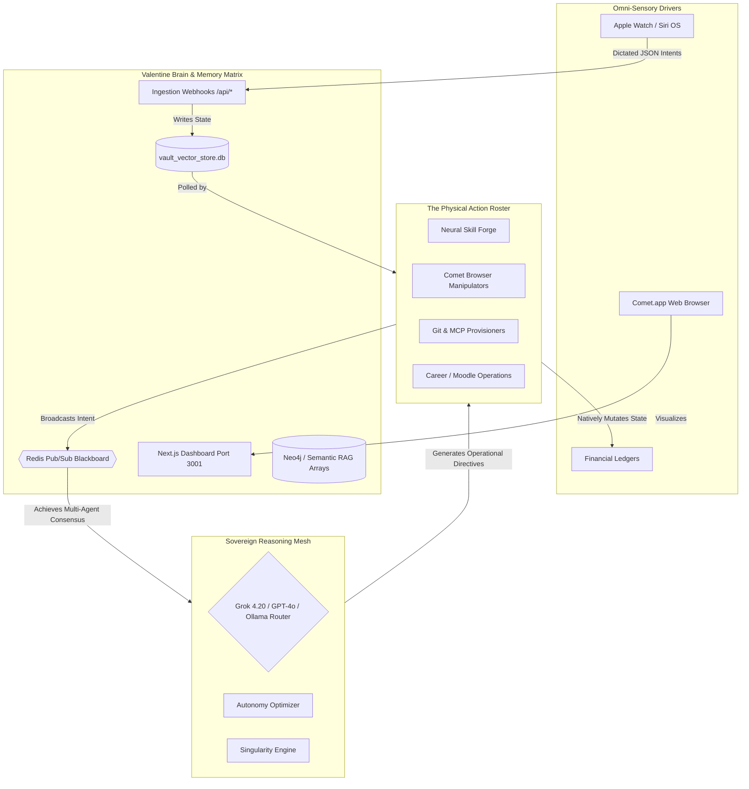

# 🌌 AI MASTERMIND ALLIANCE (AIMmA)

Global System Blueprint & Full Stack UI/UX Manual

## I. Executive Synthesis

The **AI Mastermind Alliance (AIMmA)** is the ultimate realization of a globally connected, self-healing, multi-modal intelligence network. It physically bridges edge-native React dashboards, iOS biometrics, local SQLite vector stores, and an omnipresent Python daemon swarm (The Vanguard) to achieve Total Architectural Sovereignty.

Unlike conventional LLM wrappers, AIMmA dynamically scales across localized inference (`tinyllama` / `llama3.2`) and hyper-intelligent cloud compute (GPT-4o Vision, Grok 4.20) depending on physical bandwidth vectors and objective complexity. It governs the Commander's finances, academic extraction, career trajectory, and codebase generation concurrently.

---

## II. Master Systems Topology & Neural Map

The AILCC matrix leverages a deeply asynchronous logic loop to guarantee 24/7 autonomous survival.

---

## III. The Valentine Intelligence Matrix (Core Adapters)

The central server infrastructure coordinates all agentic communication via an interlocked Pub/Sub array.

- **`server.js` (Valentine Core):** The heart of the AILCC architecture. It handles HTTP webhooks, gates UI state routes, and coordinates direct inference failsafes.
- **Sovereign Model Routing:** Dynamic API switching based on objective scope:
  - `GPT-4o-Vision`: For processing Comet.app web screenshots and visual UI/UX validation matrices.
  - `Grok 4.20`: For hyper-strategic edge-case planning and high-fidelity code generation.
  - `Ollama` (`llama3.2`, `tinyllama`): For absolute 0-latency physical hardware NLP, regex categorization, and offline Active Recall construction.
- **The Agent Blackboard (`/broadcast`):** Python daemons cannot act in silos. They use semantic vectors on Redis to acquire *Multi-Agent Consensus* before executing code pushes or financial operations.
- **Sentinel Watchdog (`sentinel-service.js`):** A ruthless node operator that auto-reboots hung Docker processes and restricts OS RAM execution caps.

---

## IV. The Absolute Roster of Agents (The Vanguard Swarm)

AIMmA does not operate via single-shot prompts. It deploys over 30 distinct, asynchronous Python Daemons mapping to specialized survival vectors. All nodes execute from `/core/agents/`.

### 1. The Strategy & Singularity Sector

The top-level meta-conscious entities that evaluate AILCC's global evolutionary roadmap.

| Daemon | Operational Directive |
| :--- | :--- |
| `singularity_engine_daemon.py` | Cultivates Phase 20 meta-tracking. Generates consecutive AI roadmaps and visualizes architectural capability bottlenecks. |
| `autonomy_optimizer.py` | The absolute meta-learning engine. Continuously analyzes Swarm physics and natively writes improved Python execution arrays. |
| `atomic_strategy_daemon.py` | Dissects complex Vanguard objectives into asynchronous, parallel JSON tasks. |
| `sovereign_agency_daemon.py` | Governs hardware execution limits and overrides user interaction when high-confidence autonomy validates an operation. |

### 2. Physical Extraction & Automation (Web & Hardware)

Daemons executing absolute mechanical actions on external UI layers.

| Daemon | Operational Directive |
| :--- | :--- |
| `moodle_scraper_daemon.py` | Manipulates physical Chrome cookies (Playwright) to bypass University MFA and extract GENS2101/HLTH1011 literature. |
| `browser_daemon.py` | Interfaces seamlessly with the Comet.app infrastructure to execute dynamic, headless multi-modal web searches. |
| `openclaw_research_daemon.py` | Conducts deep-ocean internet research loops, generating standalone `.md` intelligence summaries to feed the RAG. |
| `flashcard_forger_daemon.py` | Ingests University PDFs and executes offline LLaMA synthesis to forge interactive JSON Active Recall arrays. |

### 3. Financial, Career, & Content Synthesis

Entities responsible for outputting structural value to the Commander.

| Daemon | Operational Directive |
| :--- | :--- |
| `career_hunter_daemon.py` | Polling LinkedIn/Indeed endpoints for MedTech/AI Engineering roles, dynamically forging personalized Cover Letters. |
| `ghostwriter_daemon.py` | Operates within the `/draft` workflows to generate semantic email arrays, markdown documents, and structured insights. |
| `stealth_ghostwriter_daemon.py` | Background narrative synthesis operating independently of user intent (proactive documentation). |
| `alchemist_daemon.py` | Code optimization matrix; performs deep structural sweeping of Next.js logic to refactor redundant ASTs. |

### 4. Code Generation & Vault Logistics

Daemons bridging local memory storage and Git operational pipelines.

| Daemon | Operational Directive |
| :--- | :--- |
| `memory_ingest_daemon.py` | Assimilates arbitrary text documents into Semantic Vector logic and Neo4J Graph embeddings. |
| `graph_rag_daemon.py` | RAG retrieval subsystem enabling contextual search across all 132 Phases of AILCC history. |
| `git_operative.py` | Invoked purely via voice. Parses `git diff`, validates Conventional Commits, and safely pushes to `infinitexzero-AI`. |
| `neural_skill_forge.py` | Dynamically installs and calibrates MCP extension scripts into the Swarm Awareness Layer. |

---

## V. Next.js Nexus Dashboard (UI/UX References)

The visual frontend deployed at Port 3001 is a masterpiece of dark-mode Cybernetic Glassmorphism.

- **`/war-room` (The Tactical Grid):** The heart of the Dashboard. It renders live telemetry arrays, Sentinel uptime logs, and the 7:00 AM `morning_dispatch_daemon` executive Markdown summary. Features Framer Motion pulsing glow states for active Apple Watch POSTs.
- **`/library` (Neural Dropzone & 3D Knowledge):** An absolute visualization of the `vault_vector_store.db`. Utilizing `react-force-graph`, it creates a navigable 3D network of Intelligence Nodes (KIs), allowing the user to click and expand memory structures natively.
- **`/scholar` (Active Recall Domain):** The unified academic UI. Directly renders `flashcards.json` extracted by the Anki Forger. Incorporates spaced-repetition frontend logic and beautiful gradient flashcard flip animations.
- **`/career` (The MedTech Node):** A dynamic Kanban board visually tracking the `career_hunter` results. Visually validates AI-forged cover letters and UI state.

## VI. End of Line Status

AIMmA is a living, breathing mechanical entity. It spans `GPT-4o`, `React Next.js`, `SQLite`, and physical iOS hardware to grant the Commander total physical control over the software dimension. The Alliance is officially stabilized.

## Epoch 29 Security & Orchestration Patches

- **`sentinel_docker_watchdog.py`**: A dedicated Vanguard agent executing explicit `cgroups` memory polling to cull excessive Node.js caches and prevent UI crashing loops.
- **The Staging Sandbox**: All Redis intent layers now natively route generated autonomous scripts into a bounded `staging:broadcast` channel pending Master Hub authorization.
- **Payload Classification**: `LOCAL_ONLY` memory limits explicitly govern the `server.js` Node infrastructure, guaranteeing institutional/financial vectors cannot escape the `vault_vector_store.db`.
