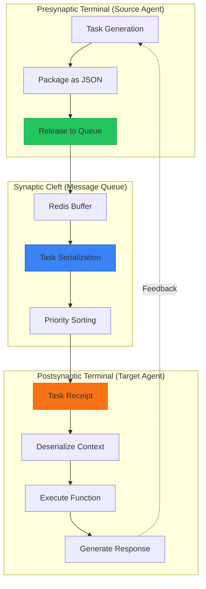
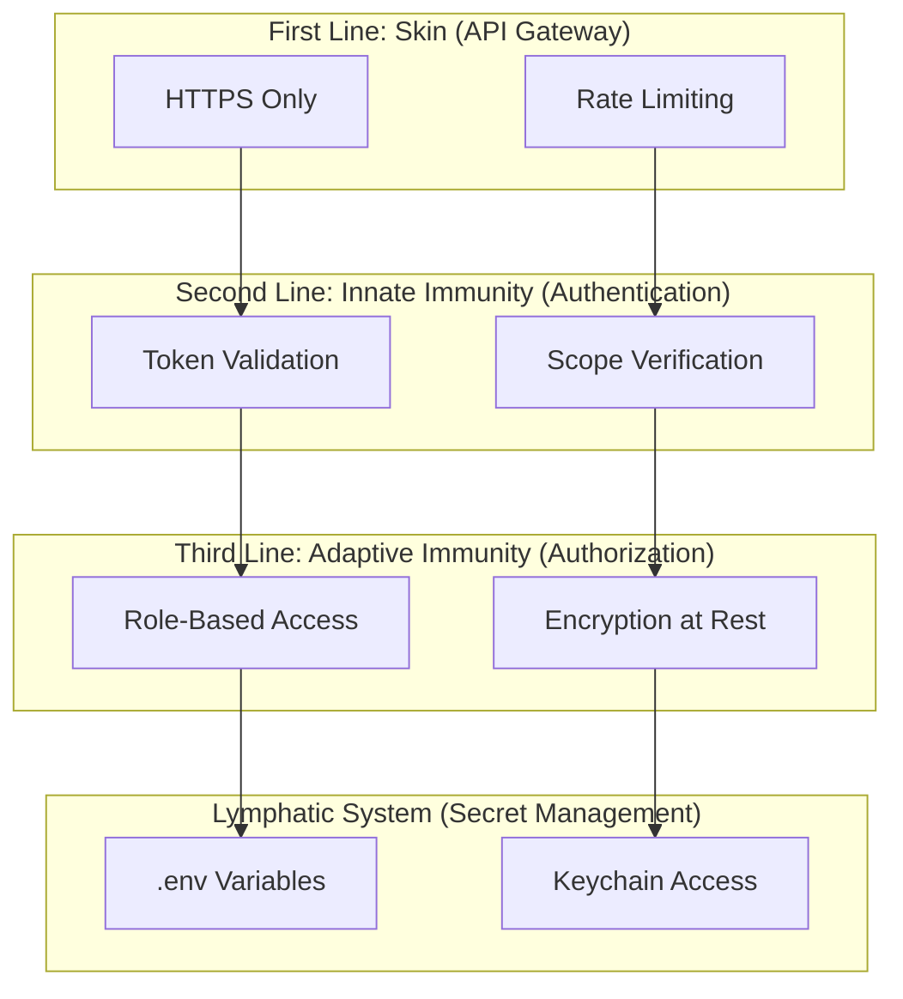

# 🧬 AI Mastermind Alliance: Neurobiological Architecture Model

## System as Synthetic Neural Organism

Your AI Mastermind Alliance operates as a distributed cognitive system with striking parallels to vertebrate neurobiology. This model defines the structure, function, and observability of the system through a biological lens.

---

## 🏗️ Three-Layer Neurological Architecture

### 1. The Brainstem Layer: Persistent Infrastructure

*Autonomic nervous system - operates without conscious thought.*

**Components:**

* **Medulla Oblongata (Valentine Core)**: Heartbeat of the system - routing, authentication, vital signs.
* **Pons (n8n Workflows)**: Bridge between conscious commands and automatic execution.
* **Cerebellum (File Storage)**: Motor memory - all artifacts, documents, code stored for instant recall.

**Biological Parallel:**

* Heart Rate → API Request Rate
* Breathing → Cron Job Schedules
* Reflexes → Webhook Triggers
* Balance → Load Balancing

> [!NOTE]
> **Observability**: 🟢 Green Status = Healthy autonomic functions.

---

### 2. The Limbic System: Active Coordination Layer

*Emotional processing, memory formation, motivation.*

**Components:**

* **Hippocampus (Shared Memory/Redis)**: Short-term to long-term memory consolidation.
* **Amygdala (Error Detection/Alerts)**: Threat assessment, priority flags.
* **Thalamus (Message Queue)**: Sensory relay station - all input filtered here before processing.
* **Hypothalamus (Task Prioritizer)**: Homeostasis maintenance, resource allocation.

**Molecular Detail:**

```javascript
// Neurotransmitter Analogs
const systemNeurotransmitters = {
  dopamine: "Task completion notifications",
  serotonin: "Steady-state workflow execution", 
  norepinephrine: "Urgent priority alerts",
  acetylcholine: "Inter-agent communication signals",
  glutamate: "Excitatory - new task initiation",
  GABA: "Inhibitory - throttling, rate limiting"
}
```

> [!NOTE]
> **Observability**: 🔵 Blue Status = Active processing, memory formation in progress.

---

### 3. The Neocortex: Hardlined Intelligence Core

*Higher reasoning, executive function, consciousness.*

* **Prefrontal Cortex (Strategic Planning)**: Agent **Claude** (Architect) - Executive decision-making, system design.
* **Motor Cortex (Execution)**: Agent **ChatGPT** (Coder) - Implementation, code generation.
* **Visual Cortex (Perception)**: Agent **Gemini** (Craftsman) - Multimodal analysis, Google Workspace integration.
* **Temporal Lobe (Language & Research)**: Agent **Perplexity** (Scout) - Information retrieval, research.
* **Association Areas (Command & Control)**: Agent **Grok** (Judge) - Meta-coordination, strategic directives.

> [!NOTE]
> **Observability**: 🟡 Yellow Status = Conscious processing, decision-making active.

---

## 🔬 Molecular-Level Data Flow: Synaptic Transmission



---

## 🧪 Neurotransmitter Cascade Protocols

### Dopamine Circuit (Reward/Motivation)

```javascript
// Task Completion Dopamine Release
async function completeTask(taskId) {
  const result = await executeTask(taskId);
  if (result.success) {
    await notificationHub.send({
      type: 'success',
      message: `✅ ${taskId} completed`,
      dopamine_level: 'high',
      reinforcement: 'positive'
    });
    await learningSystem.updateExpectation(taskId, 'success');
  }
}
```

### Cortisol Circuit (Stress/Error Response)

```javascript
// Error Detection = Cortisol Spike
async function handleError(error, context) {
  const severity = assessThreat(error);
  if (severity === 'critical') {
    await alertAllAgents({
      type: 'CRITICAL_ERROR',
      cortisol_level: 'high',
      action: 'immediate_intervention'
    });
    await activateFallbacks();
  }
}
```

---

## 🔐 Sovereign Vault: Immune System Analog



---

## 🎬 Quick Ref: System as Brain

| System Component | Brain Analog | Function |
| :--- | :--- | :--- |
| Valentine Core | Medulla | Vital functions |
| Redis | Hippocampus | Memory |
| Message Queue | Thalamus | Signal relay |
| Claude | Prefrontal Cortex | Strategy |
| ChatGPT | Motor Cortex | Execution |
| Error Alerts | Amygdala | Threat detection |
| Task Priority | Hypothalamus | Homeostasis |
