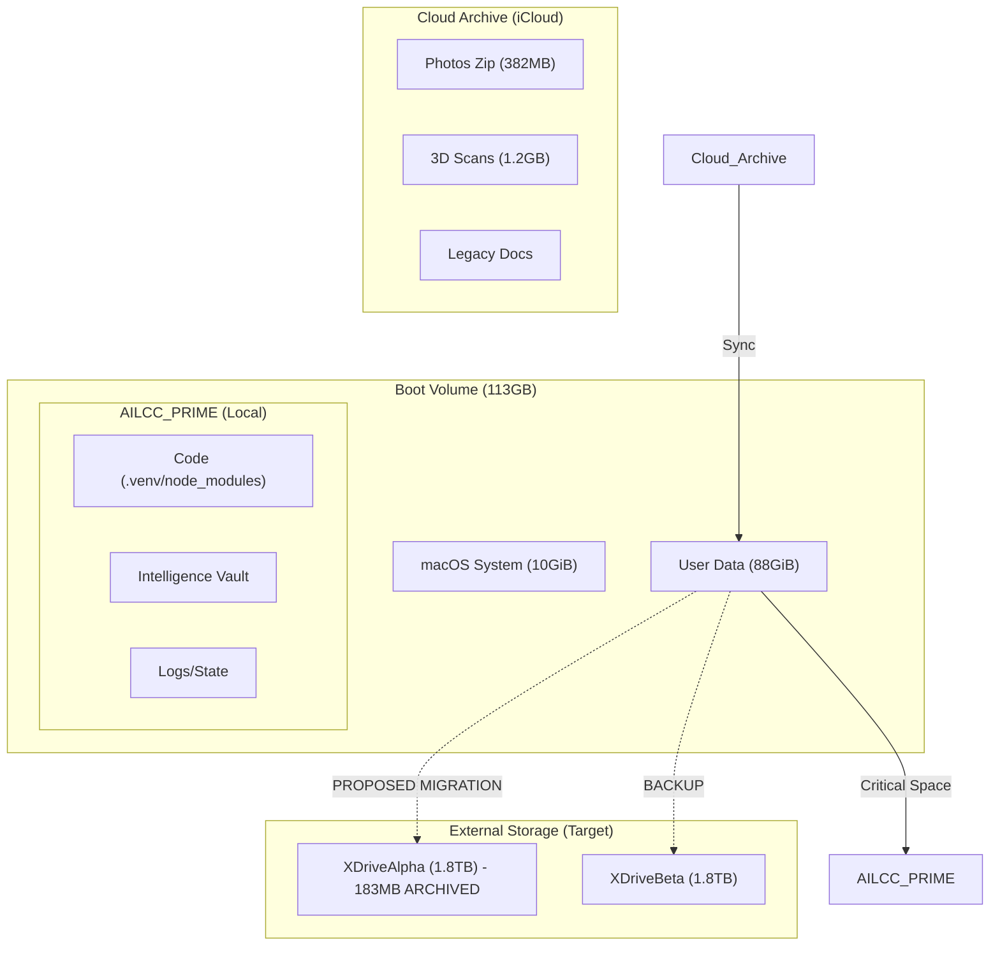

# 🗺️ Storage Topology: Hippocampus Protocol

## Data Categorization

- **High Retention (Archive)**: 3D Scans, Photos Zip, Legacy Playbooks.
- **Active Dev**: Python Virtual Envs, Node Modules, Git Pack Files.
- **Intelligence**: Academic Records, Mission Manifests, Sync State.
