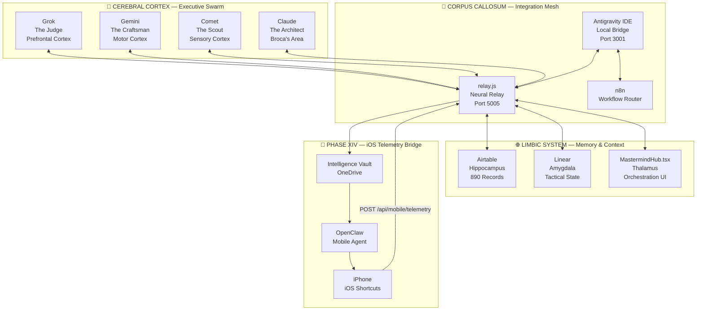
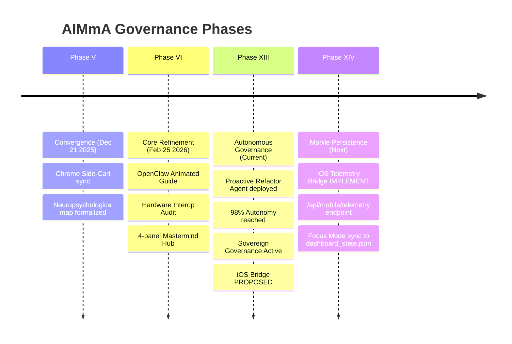

# AI Mastermind Alliance — Architectural Visualization

> **Synthesized by Claude (Broca's Area / The Architect)**
> *Phase XIII → XIV Transition | April 22, 2026*

---

## I. Swarm Connectivity — Neural Architecture

---

## II. Agent Roster & Role Matrix

| Agent | Brain Region | Department | Core Value | Phase XIV Role |
| --- | --- | --- | --- | --- |
| **Grok** | Prefrontal Cortex | The War Room | Strategic Wisdom | Entropy monitor, system health verdicts |
| **Gemini** | Motor Cortex | The Forge | Technical Excellence | Relay expansion, shortcut overhaul |
| **Comet** | Sensory Cortex | The Lookout | Vigilance & Perception | Mobile telemetry harvesting |
| **Claude** | Broca's Area | The Library | High-Fidelity Communication | Architectural docs, logic audit |

---

## III. Phase Status Map

---

## IV. Authorization State

| Integration | Status | Notes |
| --- | --- | --- |
| Airtable | ✅ AUTHORIZED | Base `AILCC_AIRTABLEBASE1` verified |
| Linear | ✅ AUTHORIZED | Token `lin_api_Qpdx9vn...` active |
| Anthropic Key | ⚠️ PENDING | Not found in Vault — user action required |
| iOS Bridge | 🔵 PROPOSED | Architecture in `IOS_TELEMETRY_BRIDGE.md` |
| Chrome Agent | 🔵 PROPOSED | Dedicated AI profile planned |
| Vercel | ✅ VERIFIED | Deployment engine active |

**Overall Autonomy: 98%** (Phase XIII complete)

---

## V. Active Discrepancy Log

> *Flagged by Claude (Logic Audit function) — requires resolution before Phase XIV lock-in*

1. **Authorization % Conflict** — `SYSTEM_ARCHITECTURE.md` reports **85%** vs **98%+** in walkthrough and task docs. Single source of truth needed.
2. **iOS Bridge Status Conflict** — `walkthrough.md` marks bridge as **IMPLEMENTED**; `IOS_TELEMETRY_BRIDGE.md` correctly marks it **PROPOSED**. The walkthrough entry is premature.
3. **Security** — `antigravity_dev_key` appears in plaintext in `IOS_TELEMETRY_BRIDGE.md` Section 4. Must be moved to `.env` / vault before Phase XIV implementation.

---

## VI. Phase XIV Implementation Checklist

- [ ] Resolve authorization % discrepancy across all docs
- [ ] Implement `/api/mobile/telemetry` endpoint in `relay.js`
- [ ] Update "Hey Nexus" Shortcut for multi-parameter JSON payloads
- [ ] Automate Focus Mode → `dashboard_state.json` persistence bridge
- [ ] Move `antigravity_dev_key` out of plaintext into vault
- [ ] Ingest Anthropic API key into Credential Vault
- [ ] Upload `CLAUDE_PROJECT_IDENTITY.md` to Claude Project

---

*Document synthesized via Spectral Canvas by Claude — The Architect*
*Neural Relay: Port 5005 | Dashboard: localhost:3000 | Vault: AILCC_VAULT/Ghostwriter_Outputs*
