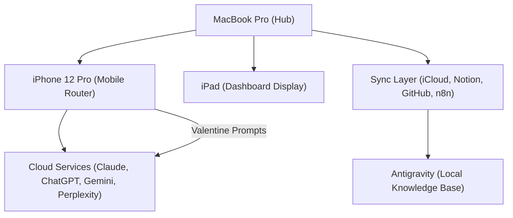

# 🌌 ALLIANCE INTEGRATION 2025: MASTER MANIFEST

**Status**: DEPLOYMENT READY | **Sync Code**: `creek bone alley slim` | **Date**: 2025-12-27
**Orchestration**: AILCC Mode 5+ | **Arbiter**: Valentine

---

## 🏗️ 1. SYSTEM ARCHITECTURE (4-LAYER MODEL)

### Core Components
1. **MacBook Pro**: The central command hub and primary compute engine.
2. **iPhone (Valentine)**: Mobile router using Grok for autonomous task classification and routing.
3. **iPad**: Always-on dedicated display for the interactive Nexus Dashboard.
4. **Cloud/Local Hybrid**: Seamless synchronization between local SQLite (Antigravity) and external APIs.

---

## ⚡ 2. VALENTINE AUTONOMOUS STEERING PROMPTS

> [!IMPORTANT]
> Copy these prompts into your iPhone Notes or Grok system instructions for immediate mobile delegation.

### Prompt 1: Task Classification & Routing
"Act as Valentine, the OMNI-Arbiter. Classify the following input into: `RESEARCH`, `EXECUTION`, `SYNC`, or `ESCALATION`. If `RESEARCH`, route to Perplexity/Scholar. If `EXECUTION`, hand off to Antigravity/Terminal. If `SYNC`, trigger n8n webhook."

### Prompt 2: Signal Synthesis
"Synthesize recent signals from [PLATFORM] regarding [TOPIC]. Identify 3 actionable steps and 1 potential bottleneck for the MacBook hub."

---

## 📅 3. 14-DAY IMPLEMENTATION ROADMAP

| Phase | Days | Goal | Key Action |
| :--- | :--- | :--- | :--- |
| **1: Foundation** | 1-3 | Infra Setup | Initialize `Antigravity.db` & Git Repo |
| **2: Core System**| 4-7 | Dashboard & n8n | Deploy `nexus_dashboard.html` & n8n flows |
| **3: Mobile** | 8-10| Mobile Router | Configure iPhone -> MacBook real-time sync |
| **4: Automation**| 11-14| Go-Live | Activate scheduled task monitoring |

---

## 🖥️ 4. NEXUS DASHBOARD SPECIFICATION

- **Aesthetics**: Glassmorphism, Dark Mode, Neo-Brutalist accents.
- **Views**:
    - **System Health**: CPU, Discord/WebSocket heartbeat, Sync status.
    - **Agent Registry**: Active status of Claude, ChatGPT, Gemini, Grok.
    - **Task Routing**: Live feed of Valentine's classifications.
    - **Intelligence Pulse**: Latest signals from the Intelligence Vault.

---

## 🔗 5. NEXT STEPS & DELEGATION

### 👤 Human Actions (Required)
1. **Download Artifacts**: Ensure all 6 `.md` files from the Perplexity thread are in `~/Documents/AI-Mastermind-Alliance/`.
2. **Setup n8n**: Approve webhook triggers in the local n8n instance.
3. **Notion Sync**: Import this manifest into the `COMET Orchestration` page.

### 🤖 AI Actions (Autonomous)
1. **Monitor Signals**: Continuously scan for TEK and academic updates.
2. **Sync State**: Maintain consistency between Antigravity and Notion.
3. **Route Tasks**: Valentine to handle 90% of incoming mobile prompts.

---
> **"The infrastructure is set. The roadmap is clear. We move from planning to persistent execution." — Valentine**
