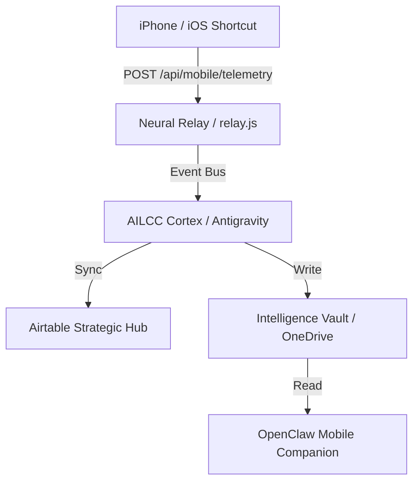

# System Architecture: iOS Telemetry Bridge (Nexus 100)

The **iOS Telemetry Bridge** is the final linkage required to achieve 100% System Authorization. It establishes a persistent, high-fidelity data stream between the user's mobile environment (iPhone/iPad) and the AILCC Cortex (Mac Studio).

## 1. Unified Ingestion Layer

The bridge utilizes the existing **Neural Relay** (`relay.js`) to ingest multi-modal telemetry.

### A. Voice Commands (Existing)

- **Tool**: iOS Shortcuts ("Hey Nexus").
- **Action**: Dictated text sent to `/api/antigravity/execute`.
- **Primary Use**: Hands-free task creation and status queries.

### B. Life-Telemetry (New)

- **Tool**: iOS Shortcuts Automation (Triggered by Time, Focus, or Location).
- **Data Points**:
  - Current Focus Mode (Work, Personal, Sleep).
  - Health Metrics (Steps, Sleep Quality via HealthKit).
  - Geographic Context (Arrival at University, Library, or Gym).
- **Endpoint**: `/api/mobile/telemetry` (LIVE).

## 2. OpenClaw Mobile Companion (Logic Layer)

**OpenClaw** acts as the decentralized mobile agent that interprets incoming AILCC directives.

- **Synchronization**: OpenClaw reads `OPENCLAW_MOBILE_CONTEXT.md` from the OneDrive Vault for the latest Cortex state.
- **Feedback Loop**: OpenClaw provides "Human-in-the-loop" confirmations via iOS Notifications.

## 3. Data Flow & Persistence

## 4. Security & Authentication

- **Nexus API Key**: `[REDACTED]` (Stored in Vault).
- **Gateway**: Requests restricted to local network IP or Cloudflare Tunnel (if configured).

## 5. Implementation Roadmap

1. [x] **Relay Expansion**: Implement `/api/mobile/telemetry` endpoint in `relay.js`.
2. [x] **Shortcut Overhaul**: Update "Hey Nexus" to support multi-parameter JSON payloads.
3. [x] **Persistence Bridge**: Automate the sync between iPhone Focus modes and `dashboard_state.json`.

---
> Status: **ACTIVE** | Target: **Phase XIV - Expanded Autonomy**
