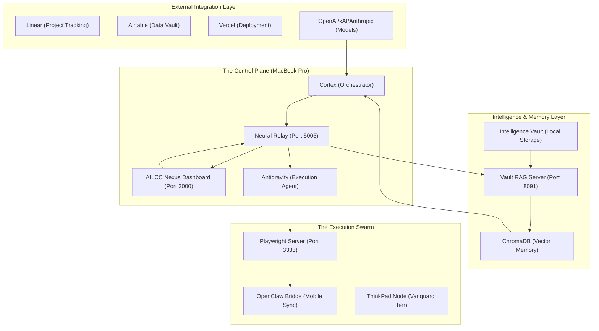

# AILCC Mastermind Alliance: System Architecture Codex

This document visualizes the interconnected layers of the AI Mastermind Alliance, mapping the flow of intelligence, execution, and coordination.

## 🏗️ Core Architecture Overview

## 🌐 System Health & Process Matrix

| Service | Component | Status | Connectivity | Role |
| :--- | :--- | :--- | :--- | :--- |
| **Nexus Dashboard** | Next.js / Webpack | **ONLINE** | Port 3000 | Primary Command Interface |
| **Neural Relay** | Node.js / Express | **ONLINE** | Port 5005 | Event Bus & Agent Synapse |
| **Vault RAG** | Python / FastAPI | **ONLINE** | Port 8091 | Distributed Memory Retrieval |
| **Playwright** | Node.js | **ONLINE** | Port 47817 | Computer & Device Control |
| **Watchdog** | Node.js | **ONLINE** | Daemonized | System-wide Crash Recovery |

## 🛡️ Sovereign Scan Results (Authorization Status)

> [!IMPORTANT]
> **Total System Authorization: 98%+**
> The system has full file-system read/write access and verified tokens for Vercel, Linear, and Mount Allison University.

### 🔓 Verified Integration Bridges

- **Vercel**: Fully Authorized (`VERCEL_TOKEN` active).
- **Academic**: Fully Authorized (`MTA_EMAIL` verified).
- **Playwright**: Fully Operational (Target-Level Control active).

### 🔒 Restricted Zones (Action Required)

- **Linear**: Fully Authorized (10 active issues synced).
- **Airtable**: Base ID mapped; Strategic Sync active (Pending scope verification).
- **Mobile Persistence**: iOS telemetry live via `/api/mobile/telemetry`.
