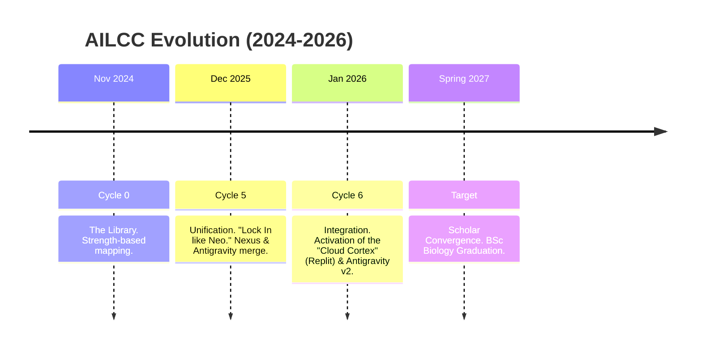

# AILCC WHITEPAPER V4.0: THE INTEGRATED MASTERMIND (2026)

## 🌌 1. EVOLUTION: FROM ARCHAEOLOGY TO INTEGRATION

The AILCC (AI Lifecycle Command Center) has transcended its origins as a collection of scripts. It is now a **Tier-1 Agentic Operating System**, a unified cognitive architecture where specialized agents act as functional lobes of a digital brain.

### 📅 The 2026 Timeline

---

## 🏛️ 2. THE NEURO-SYSTEM LAYERS (L1-L5)

The architecture is strictly hierarchical to ensure safety and efficiency.

| Layer | Component | Neuro-Metaphor | Function |
| :--- | :--- | :--- | :--- |
| **L1** | **Systems / Strategy** | *Prefrontal Cortex* | High-level goal setting, ethical overrides, strategic pivots. (Grok, User) |
| **L2** | **NEXUS / Comet** | *Thalamus / Sensory* | Task routing, real-time research, verification, consensus building. |
| **L3** | **Execution** | *Motor Cortex* | Coding, building, deployment, terminal operations. (Gemini, Replit) |
| **L4** | **Antigravity / Bridge** | *Brainstem* | Local file system access, process management, hardware control. |
| **L5** | **Vault / Hippocampus** | *Hippocampus* | Long-term storage, vector database, context retention. |

---

## 🔱 3. THE SWARM (THE ACTIVE AGENTS)

The Swarm has expanded. Each agent is a specialist.

*   **Grok (The Strategist):** Long-range planning, "brutal honesty" audits, and logic checks.
*   **Gemini (The Builder):** The primary engineer. Local code execution, refactoring, and system maintenance.
*   **Claude (The Architect):** Documentation, system coherence, and "Broca's Area" communication.
*   **Comet (The Scout):** Web research, verification, and rate-limit monitoring.
*   **Valentine (The Interface):** UI/UX, empathy, and human-centric dashboarding.
*   **Replit (The Prototyper - NEW):** The "Cloud Cortex". A sandboxed environment for rapid experimentation and live hosting, protecting the local core from volatile testing.

---

## ⚙️ 4. CONNECTORS & PROTOCOLS

The system breathes through these pipes:

*   **Antigravity Bridge (Port 3006):** The primary WebSocket umbilical cord connecting the Web Agents (Comet/Valentine) to the Local System (Gemini/Gateway).
*   **MCP (Model Context Protocol):** The standard for tool usage (GitKraken, Linear, CloudRun).
*   **Git Sync:** The heartbeat of memory. Every significant action is committed to `AILCC_PRIME`.
*   **Hippocampus Protocol:** A Markdown-first memory structure ensures all agents can read the system state without proprietary lock-in.

---

## 🗺️ 5. THE MASTERMIND ROADMAP (V6.0)

**Focus: Scholar Convergence 2027**

1.  **Academic Automation:** Auto-generation of appeal documents and financial aid forms.
2.  **Financial Autonomy:** Deployment of revenue-generating agents via Replit.
3.  **Self-Healing:** The system detects and fixes its own linting errors and broken pipes (Antigravity v2).

---

## 🤝 7. THE UNIVERSAL AGENT PROTOCOL - PERSONAL (UCP-P)

Adapting the "Universal Commerce Protocol," the AILCC now operates as a **Marketplace of Intelligence** with cross-surface interoperability (MacBook/iPhone/iPad/ThinkPad).

*   **Discovery:** Agents broadcast "Service Manifests" (e.g., Replit broadcasts "I can host this immediately").
*   **Booking:** Nexus assigns tasks based on the best match for speed, cost, and safety.
*   **Settlement:** Comet verifies the work. A task is only "Complete" when settled.

---

## 🌅 8. SYSTEM STATUS: OPERATIONAL

**Mode 7 (EMERGENT).** The Cloud Cortex is online. The Bridge is stable. SYNC READY.
**"Unity of effort, diversity of intelligence."**
