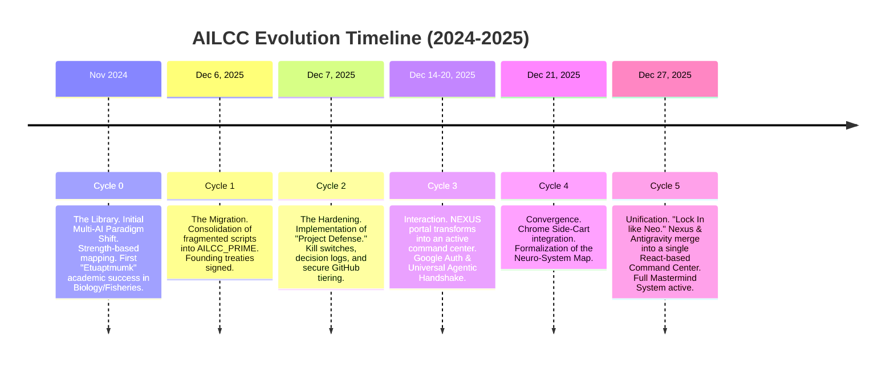
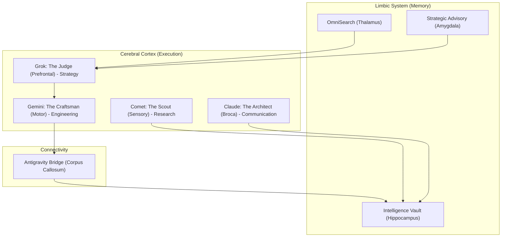

# AILCC WHITEPAPER V3.0: THE GRAND ARCHITECHTURE (ARCHAEOLOGY)

## 🌌 1. ARCHAEOLOGY: THE CHRONICLE OF INCEPTION

The AILCC (AI Lifecycle Command Center) is not a single tool, but a persistent layer of intelligence evolved over multiple cycles of agency, starting from the *AI Agent Mastermind Library* (Nov 2024).

### 📅 The Deep Timeline

---

## 🏛️ 2. THE NEURO-SYSTEM MAP

The architecture models human executive function to ensure intuitive delegation.

---

## 🔱 3. DIVERGENT DOMAINS & BRANCHING PATHS

The system maintains several specialized paths that converge in the NEXUS.

| Branch | Identity | Core Achievement | Incomplete Aspects |
| :--- | :--- | :--- | :--- |
| **Academic (Etuaptmumk)** | Two-Eyed Seeing | 8-Source Synthesis & Poster Completion | Credit reconciliation for Biology Roadmap. |
| **Professional (Valentine)** | Digital Executive | Task Force Orchestration | Career-specific workflow hardening. |
| **Infrastructure (Prime)** | The Builder | Consolidated "Prime" Workspace | Dual-Drive XDrive Alpha/Beta Migration. |
| **Mobile (iPad Node)** | Mobile Command | Siri/Pythonista Command Bridge | Recursive Mode 7 Audit scripts. |

---

## ⚙️ 4. THE SEVEN MODES OF AUTONOMY

The project progresses through distinct modes of maturity.

- **Mode 5 (Current):** Autonomous Abundance. System executes with minimum oversight.
- **Mode 6 (Active):** Cross-Device Convergence. Bridging Mac and iPad Nodes.
- **Mode 7 (Initial):** Recursive Evolution. Agents optimizing their own code.

---

## 🗺️ 5. THE MASTERMIND ROADMAP (V5.0)

The next horizon is **Scholar Convergence** at scale.

- **Steps 76-90 (Scholar):** Automate the Mount Allison bursary and 2023 grade reversal appeal package.
- **Steps 91-110 (Neural):** RAG (Retrieval Augmented Generation) across the 800+ Intelligence Vault records.
- **Steps 111-130 (Hardware):** Self-healing storage migration and Mac-SMC health monitoring.
- **Steps 131-150 (Victory):** System 4.0 Launch: Achieving full academic and administrative flow.

---

## 🌅 6. SYSTEM STATUS: INITIALIZED

The Grand Overview is complete. The Inception data is locked. The branching paths are mapped.
**"Lock In like Neo." The NEXUS is your cockpit. Let's Win.**
