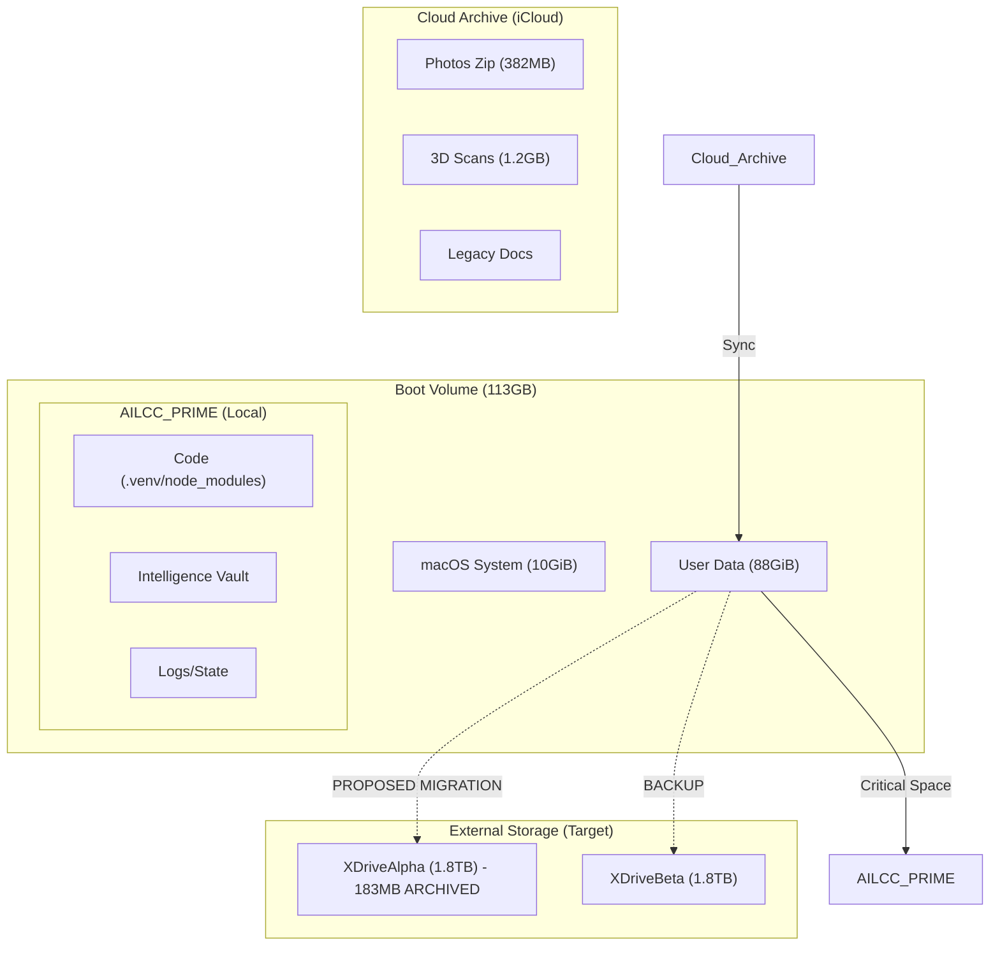

# 🗺️ Storage Topology: Hippocampus Protocol (Historical)

> **SUPERSEDED** by the comprehensive Valentine System Triage strategy:  
> [valentine_cloud_storage_triage_strategy.md](/Volumes/XDriveBeta/AILCC_PRIME/docs/05_Templates/valentine_cloud_storage_triage_strategy.md)

This older document captured early 2025 local boot volume + basic iCloud/External thinking. The 2026 cloud reality (4-provider File Provider topology under `/Users/infinite27/Library/CloudStorage/` + iCloud) is fully documented and actionable in the new strategy, including:
- Safe shallow inventory (ls -1 only, no hydration)
- Master template for OneDrive-MountAllisonUniversity (_ACTIVE_2026_Summer + _ARCHIVE)
- Precise classification rules (Academic / Personal / Google Cold / iCloud Mirror)
- Antigravity automation roadmap
- 6-day checklist tightly integrated with the May 26–June 1 Vanguard Sprint + June 1 move-out buffer

**See the new doc for all current recommendations, diagrams, and execution steps.** Old mermaid retained below for archive only.

## Data Categorization (Legacy)

- **High Retention (Archive)**: 3D Scans, Photos Zip, Legacy Playbooks.
- **Active Dev**: Python Virtual Envs, Node Modules, Git Pack Files.
- **Intelligence**: Academic Records, Mission Manifests, Sync State.
