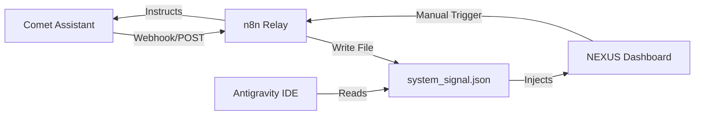

# 📡 SPECS: Intelligence Relay Dashboard Widget

**Objective**: To provide a real-time visual indicator of the sync status between web-based agents (Comet) and the local environment (Antigravity).

---

## 🛠️ FUNCTIONAL REQUIREMENTS

1. **Pulse Indicator**: A glowing HSL gradient dot reflecting connection health.
   - **Green**: Active Sync (Last ping < 60s).
   - **Yellow**: Desync Warning (Last ping > 300s).
   - **Red**: Disconnected.
2. **Current Goal Display**: A mirrored string from `system_signal.json["system_pulse"]["primary_objective"]`.
3. **Handoff Log**: A scrollable micro-feed of the last 5 `agent_signals`.
4. **Command Trigger**: A "Manual Refresh" button that triggers an n8n webhook to ping Comet for a state update.

---

## 🏗️ DATA FLOW SCHEMA

---

## 🎨 UI/UX DESIGN (NEXUS Aesthetic)

- **Style**: Glassmorphism with subtle backdrop-blur.
- **Typography**: `Outfit` or `Inter`, 12px for feeds, 14px for headers.
- **Micro-animations**: Pulse effect on the status dot; slide-in for new handoff log entries.

---

## 📂 IMPLEMENTATION STEPS

1. Update `NexusDashboard.tsx` (or equivalent) to poll `system_signal.json`.
2. Implement the `n8n_bridge.py` endpoint for receiving Comet discovery payloads.
3. Configure Comet's "System Prompt" to include the intelligence relay endpoint.

### Design Intent

"Visibility is the first step to control." — Grok
