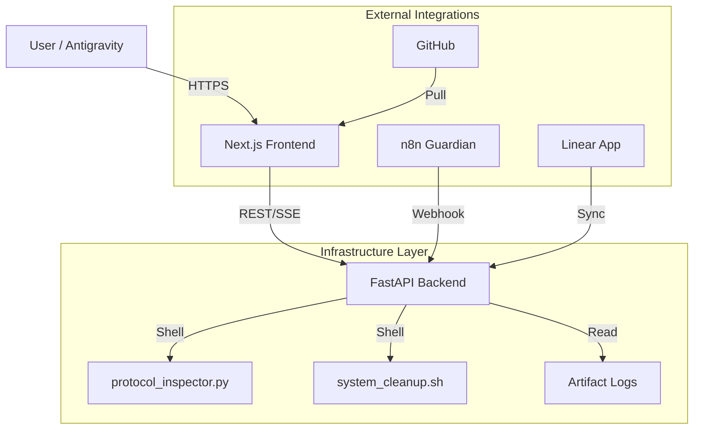

# PRIME Dashboard: Technical Specification (v1.0)

**Status:** Draft | **Phase:** 5 | **Target:** Next.js 14 + FastAPI

---

## 1. Executive Summary

The **PRIME Dashboard** is the "Single Pane of Glass" for the AI Mastermind Alliance. It visualizes the state of the underlying infrastructure (Storage Protocol v1.2), tracks active projects across all agents (Antigravity, Claude, Comet), and provides a central interface for triggering orchestration workflows.

## 2. System Architecture



## 3. Data Model: `AllianceArtifact`

A unified schema to track work items across agents.

```json
{
  "id": "uuid-v4",
  "project": "PRIME | VALENTINE | SCHOLAR | TEK",
  "type": "DOCUMENT | CODE | WORKFLOW | MEDIA",
  "title": "String",
  "path": "/absolute/path/to/file",
  "agent_owner": "Antigravity | Comet | Claude | n8n",
  "status": "DRAFT | REVIEW | FINAL",
  "created_at": "ISO-8601",
  "metadata": {
    "version": "1.2",
    "tags": ["infrastructure", "critical"]
  }
}
```

## 4. API Specification (FastAPI)

### Core Endpoints

| Method | Endpoint | Description |
| :--- | :--- | :--- |
| `GET` | `/api/health` | Returns Protocol Inspector status (Green/Yellow/Red). |
| `GET` | `/api/stream/status` | SSE endpoint for real-time dashboard updates. |
| `GET` | `/api/artifacts` | List artifacts with filtering (project, agent). |
| `POST` | `/api/artifacts` | Register a new artifact (called by Agents). |
| `POST` | `/api/workflow/:id` | Trigger system workflow (e.g., `cleanup`, `snapshot`). |

### State Management

* **Storage State:** Polled every 30s via `protocol_inspector.py`.
* **Artifact State:** Persisted in `~/AILCC_PRIME/AI-MasterMind-Alliance/data/artifacts.jsonl` (Append-only log).

## 5. UI Component Hierarchy

### `DashboardLayout` (Shell)

* **Navigation:** Sidebar with generic project icons (Glassmorphism).
* **StatusOverlay:** Global warning banner if System Health != GREEN.

### `OverviewPage` (Home)

* `StorageHealthWidget`: Visual gauge of SSD/LaCie status.
* `ActiveProjectGrid`: Cards for PRIME, VALENTINE, etc.
* `RecentActivityFeed`: Timeline of `AllianceArtifact` creations.

### `ProjectDetail` (Dynamic Route)

* `ArtifactList`: Filtered view of artifacts for specific project.
* `AgentStatus`: Who is working on this? (derived from recent logs).

## 6. Design System (TEK Palette)

* **Background:** Deep Earth (`#1a1a1a`) with Aurora Accents (`#2A9D8F`).
* **Cards:** Glassmorphism (`bg-white/5 backdrop-blur-md`).
* **Typography:** Inter (Headings), JetBrains Mono (Code/Status).
* **Status Colors:**
  * 🟢 Green: `#10B981`
  * 🟡 Yellow: `#F59E0B`
  * 🔴 Red: `#EF4444`

## 7. Implementation Roadmap

1. **Backend:** Finish `main.py` implementation (Artifact CRUD).
2. **Frontend:** Initialize Next.js app (Post-Offload).
3. **Integration:** Connect `protocol_inspector` output to state.
4. **Agent Handoff:** Update Agent definitions to POST to `/api/artifacts`.
